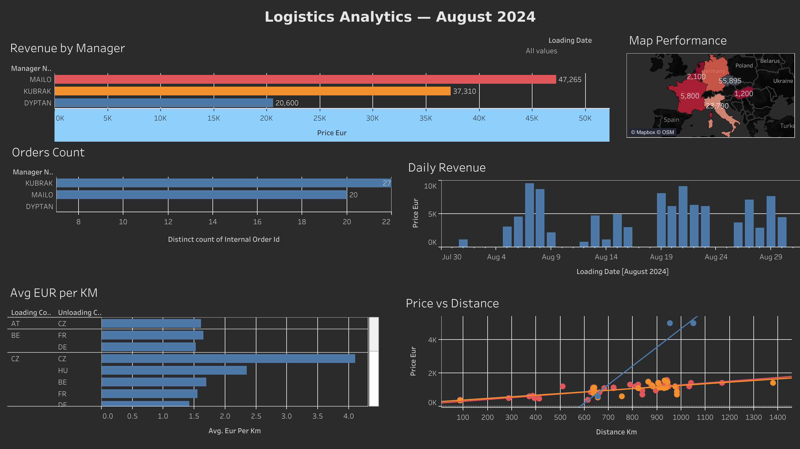

# BigQuery SQL Pet Project: Logistics Data Warehouse

Цей проєкт демонструє повний цикл перетворення сирих логістичних даних із Google Sheets у нормалізоване сховище даних у Google BigQuery за архітектурою «Зірка» (Star Schema) — від очищення та типізації до побудови аналітичних запитів.

## 🛠️ Технологічний стек

| Інструмент      | Призначення                |
|-----------------|----------------------------|
| Google BigQuery | Сховище даних (Sandbox)    |
| GoogleSQL       | Трансформація та аналітика |
| Google Sheets   | Джерело сирих даних        |
| dbdiagram.io    | Моделювання схеми          |
| Tableau Public  | Візуалізація та дашборд    |

## Архітектура проєкту

```
stg_raw_august   ← сирі дані (Google Sheets → BigQuery)
       ↓
   ETL / SQL
       ↓
dim_managers     ← довідник менеджерів
dim_geography    ← довідник унікальних адрес
dim_trucks       ← довідник автомобілів
       ↓
   fct_orders    ← таблиця фактів (Star Schema)
```

## Етап 1 — Проєктування та нормалізація

Сирі дані містили типові аномалії реального бізнесу: дублікати, порожні рядки, фінансові значення у вигляді тексту (`€1 150,00`), дати у форматі `ДД.ММ.РРРР` та транзитивні залежності адрес.

Дані приведені до **3NF** та розподілені на зіркову схему:

- `fct_orders` — факти замовлень: метрики (`price_eur`, `distance_km`), дати завантаження та розвантаження, зовнішні ключі до довідників
- `dim_managers` — менеджери (логісти)
- `dim_trucks` — реєстраційні номери автомобілів
- `dim_geography` — унікальні точки завантажень та розвантажень

## Етап 2 — Очищення та Data Quality

- **Фінанси:** рядки `"€1 150,00"` → `FLOAT64` через `REGEXP_REPLACE` (видалення `€`, `\xa0`, заміна коми)
- **Дати:** формат `ДД.ММ.РРРР` → `YYYY-MM-DD` через `SAFE.PARSE_DATE`
- **Цілісність:** 94 замовлення, 0 "завислих" записів після фільтрації

Перевірка якості даних : [`scripts/01_data_quality_checks.sql`](scripts/01_data_quality_checks.sql)

## Етап 3 — Схема даних


```sql
CREATE OR REPLACE TABLE `pet-project-ymailo.pet_project.dim_geography` (
  geography_id INT64,
  full_address STRING
);

CREATE OR REPLACE TABLE `pet-project-ymailo.pet_project.dim_managers` (
  manager_id INT64,
  manager_name STRING
);

CREATE OR REPLACE TABLE `pet-project-ymailo.pet_project.dim_trucks` (
  truck_id INT64,
  truck_number STRING
);

CREATE OR REPLACE TABLE `pet-project-ymailo.pet_project.fct_orders` (
  internal_order_id      STRING,
  loading_geography_id   INT64,
  unloading_geography_id INT64,
  manager_id             INT64,
  price_eur              FLOAT64,
  distance_km            INT64,
  loading_date           DATE,
  unloading_date         DATE
);
```

## Етап 4 — Трансформація (ETL)

Скрипт [`scripts/02_transformation.sql`](scripts/02_transformation.sql) виконує повну трансформацію сирих даних у зіркову схему:

- `dim_managers` — 3 менеджери з `UNION ALL`
- `dim_geography` — унікальні адреси через `UNION DISTINCT` завантажень і розвантажень
- `fct_orders` — факти з `LEFT JOIN` до всіх довідників, очищеними фінансами та датами
- `vw_tableau_final` — аналітична вʼюха з `eur_per_km`, `days_in_transit` та кодами країн для Tableau

## 📊 Аналітичний дашборд (Tableau)

На основі побудованої Star Schema розроблений інтерактивний дашборд у Tableau Public для візуалізації ключових метрик логістики за серпень 2024 року.

**Ключові інсайти:**
- **Менеджери:** MAILO лідирує за доходом (€47,265) та кількістю замовлень (52)
- **Географія:** CZ домінує як точка призначення з сумарним доходом €55,895
- **Ефективність маршрутів:** CZ→CZ показує середній €/km у 3x вище за інші напрямки
- **Динаміка:** піки навантаження припадають на 7-8 та 19-21 серпня

▶️ [Переглянути дашборд на Tableau Public](https://public.tableau.com/views/Logistics_Analytics_August_2024/LogisticsAnalyticsAugust2024)



## 📈 Висновки

Серпень 2024 — загальна виручка **€105,175** по **94 замовленнях**.

- **MAILO** генерує найбільше виручки (€47,265) і веде 52 замовлення
- **KUBRAK** — другий за виручкою (€37,310) з 37 замовленнями
- Маршрут **CZ→CZ** — найефективніший за €/km (~4.0), що втричі перевищує середній по компанії
- **Чехія** домінує як точка призначення (€55,895 — більше половини загальної виручки)
- На scatter plot видно два outliers (KUBRAK) з ціною ~€5,000 при відстані 900+ km
- Два піки навантаження: **7-9 серпня** і **19-21 серпня**, між якими помітний спад
- **DYPTAN** веде 5 внутрішніх корпоративних перевезень — ці рейси не є ринковими, тому показник €/km некоректно порівнювати з комерційними замовленнями MAILO та KUBRAK

> **Примітка:** `Orders Count` на дашборді використовує `COUNT DISTINCT` по
> `internal_order_id` — round trip рейси мають спільний ID, тому відображається
> менша кількість. Фактична кількість рядків: MAILO — 52, KUBRAK — 37, DYPTAN — 5.
