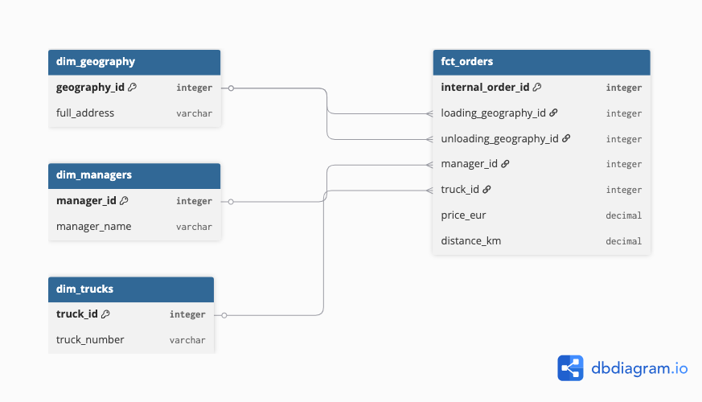

# BigQuery SQL Pet Project: Logistics Data Warehouse

Цей проєкт демонструє трансформацію сирих логістичних даних із Google Sheets у нормалізоване сховище даних (Data Warehouse) у **Google BigQuery** за архітектурою «Зірка» (Star Schema), а також аудит цілісності даних за допомогою SQL.

## 🛠️ Технологічний стек
* **Сховище даних:** Google BigQuery
* **Джерело даних:** Google Sheets (External Tables через Drive URI)
* **Мова запитів:** GoogleSQL (BigQuery SQL)

## 📐 Етап 1: Проєктування та Нормалізація (1NF, 2NF, 3NF)
Сирі денормалізовані дані за серпень (`stg_raw_august`) містили дублікати, пусті рядки та текстові назви замість ідентифікаторів. Для уникнення аномалій та оптимізації аналітики дані були приведені до стану **3NF (Третьої нормальної форми)** та розподілені на зіркоподібну схему:

1. **Таблиця фактів (`fct_orders`):** Містить унікальні ID замовлень, числові метрики (`price_eur`, `distance_km`) та зовнішні ключі (FK) для зв'язку з довідниками.
2. **Таблиці вимірів (Довідники / Dimensions):**
   * `dim_managers` — дані про менеджерів (логістів).
   * `dim_drivers` — інформація про водіїв.
   * `dim_trucks` — державні номери автомобілів.
   * `dim_geography` — унікальні адреси завантажень та розвантажень (запобігає транзитним залежностям адрес).

## 🔍 Етап 2: Очищення та Перевірка цілісності (Data Quality)
Для збирання таблиці фактів було написано SQL-скрипт із використанням функцій `TRIM` для зачистки пробілів та фільтрацією пустих Excel-рядків. 

Перед стартом аналітикиведено технічний аудит цілісності даних за допомогою SQL:
* Після фільтрації зафіксовано **94 очищених замовлення** від клієнтів.
* Перевірка зв'язків показала **0 «завислих» замовлень** — кожен фрахт має або чіткий номер кругорейсу (41 замовлення), або прив'язаний автомобіль для односторонніх поїздок (53 замовлення). Дані повністю цілісні та готові до бізнес-аналізу.
## 📐 Схема даних (Database Schema)
📐 Схема даних (Database Schema)




```sql
-- ==========================================
-- 📐 СХЕМА ДАНИХ (DATABASE SCHEMA)
-- Побудовано за правилами 3NF (Зіркова схема)
-- ==========================================

-- 1. Створення довідника географії
CREATE OR REPLACE TABLE `pet-project-ymailo.pet_project.dim_geography` (
  geography_id INT64,
  full_address STRING
);

-- 2. Створення довідника менеджерів
CREATE OR REPLACE TABLE `pet-project-ymailo.pet_project.dim_managers` (
  manager_id INT64,
  manager_name STRING
);

-- 3. Створення довідника автомобілів (Траків)
CREATE OR REPLACE TABLE `pet-project-ymailo.pet_project.dim_trucks` (
  truck_id INT64,
  truck_number STRING
);

-- 4. Створення фінальної таблиці фактів замовлень
CREATE OR REPLACE TABLE `pet-project-ymailo.pet_project.fct_orders` (
  internal_order_id INT64,
  loading_geography_id INT64,
  unloading_geography_id INT64,
  manager_id INT64,
  truck_id INT64,
  price_eur FLOAT64,
  distance_km INT64,
  order_date DATE,
  unloading_date DATE,
  invoice_date DATE
);
